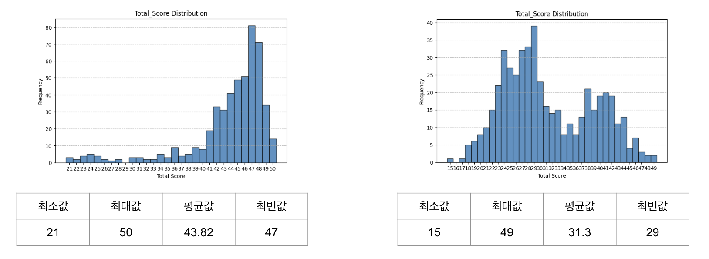
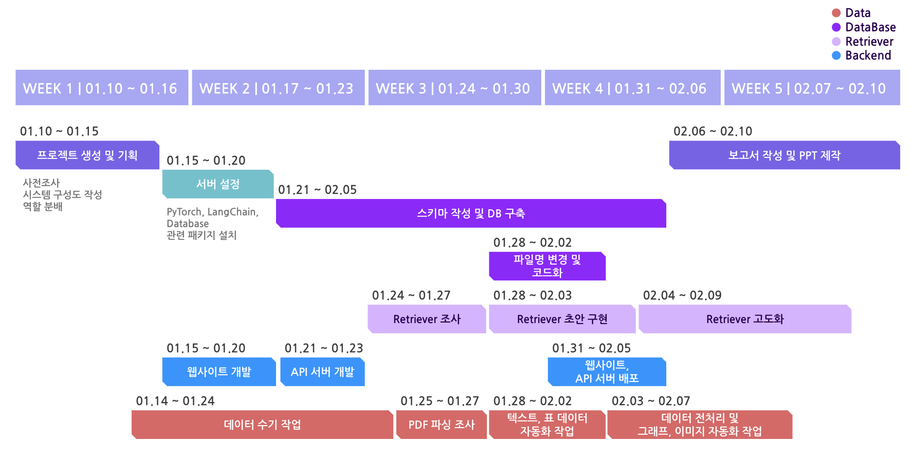

# 증권사 자료 기반 주식 LLM 서비스 개발

      

## 선정 배경

다양한 산업군에서 LLM 도입을 시도하고 있으나 **할루시네이션(Hallucination) 문제**로 어려움을 겪고 있음. 할루시네이션 제거를 위해 **RAG** 같은 기술을 도입하고 있는 추세이며, 본 프로젝트에서는 증권사 자료를 기반으로 주식 LLM 서비스를 개발하며 **RAG 기술을 탐구**하고자 함.

> 🚀 **PDF 파싱을 통한 데이터 구축 및 RAG 기술을 활용하여 할루시네이션 현상 최소화**

## 기대 효과

- **산업 특화 LLM 구축**: 증권사 보고서 뿐만 아니라 RAG 도입과 PDF 파싱 자동화로 다른 분야에서도 활용 가능한 RAG 기반 LLM 에이전트 개발
- **개인별 전문분야 탐색**: 네이버 부스트캠프 이후의 진로 탐색을 위한 팀원 각자의 전문분야 탐색

## 구현 내용

- PDF 문서로부터 텍스트, 그래프 등 정보의 추출
- 데이터 레포지토리 구축(Vector 타입 지원 RDB)
- 쿼리에 대해 가장 적합한 데이터들을 찾는 RAG 시스템 구현
- 모델 및 G-Eval 프롬프트 개발
- Q&A 기능: REST API로 구현
  - Input: Query(질의)
  - Output: Context(참조 텍스트), Answer(답변)
- G-Eval 기능: 내부 함수로 구현
  - Input: Query(질의), Context(참조 텍스트), Answer(답변)
  - Output: Retrieval Score, Generation Score

## 평가 기준

**G-Eval(Generative Evaluation)** 은 LLM이 지닌 생성 능력을 활용해 스스로의 출력을 평가하는 방법으로, 기존 평가 지표인 BLEU, ROUGE 등의 한계를 보완하기 위해 개발됨. 본 프로젝트에서는 RAG 시스템의 성능을 신속하고 일관되게 정량 평가하기 위해 G-Eval을 도입하여 평가를 진행함.

- **평가 데이터셋 구축**: 보고서당 5개의 질문-지문-정답 세트, 총 500개의 데이터
- **평가 방식**: 문서 검색(Retrieval)과 답변 생성(Generation) 개별 평가
- **보조 지표**: F1 Score, Exact Match(EM)
- **생성 도구**: GPT API를 활용한 자동 생성

## 결과

최종점수 비공개로 확인 불가

### 자체 G-Eval 결과

GPT 4o-mini를 사용해 Context 전달 유무에 따른 G-Eval 성능 비교



## 프로젝트 수행절차



## 팀원 소개
  
|  |  |  |  |  |
| :---: | :---: | :---: | :---: | :---: |  
| 김경인 | 김준섭 | 김채연 | 오승범 | 이시온 |
| Data & DB | Serving & RAG | Data & DB | Data & RAG | RAG |


## 서비스 아키텍쳐


## 사전작업

### 설치

- [konlpy](https://konlpy.org/ko/latest/install/)
- [gcloud cli](https://cloud.google.com/sdk/docs/install?hl=ko)

### PDF 데이터 

- `data` 아래에 분석할 회사명으로 폴더를 생성한 뒤 해당 폴더에 RAG에 사용할 PDF 파일을 추가
- 예시
  - 삼성전자 관련 보고서를 기반으로 RAG를 진행하려면 `data/삼성전자` 아래에 보고서 파일을 추가

### 환경변수

- `.env.sample`을 복사해서 같은 위치에 `.env` 파일을 만든 뒤 발급받은 API 키를 입력

## 코드 실행 방법

### PDF 파싱

- `scripts/get_data.ipynb` 내 모든 셀을 순서대로 실행
- PDF 데이터를 이에 대응하는 xlsx 파일으로 변환

### 데이터 처리

- PDF 파싱에서 생성한 xlsx 파일을 사전에 정의된 스키마대로 DB에 저장

```bash
python -m scripts.run_table
```

### RAG 기반 답변 생성 및 G-Eval 실행

- DB에 저장된 데이터에서 질의와 가장 유사한 문단을 지문으로 추출 및 최종 응답생성
- 최종 응답을 질의에 대해 기대하는 답변과 비교해 G-Eval 점수까지 출력

```bash
python -m src.inference
```
